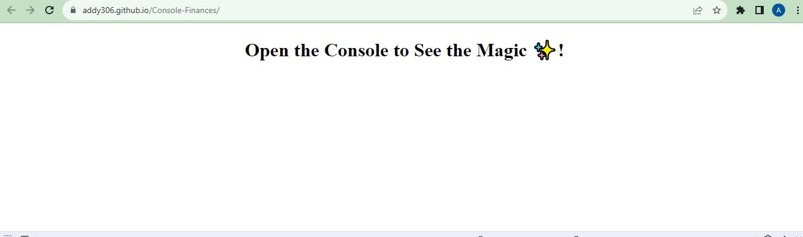
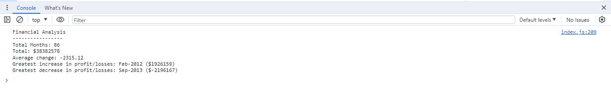

# Password-Generator

<!-- Developer Signature and github details -->
 

  

<h3 align="center">Console Finances</h3>

  

    Analyzing the financial records of a company with javascript.  
     
    <a href="https://github.com/addy306/Console-Finances"><strong>GitHub repository</strong></a>
     
    <a href="https://addy306.github.io/Console-Finances/"><strong>Deployed Website</strong></a>
     
     
    
  

<!-- ABOUT THE PROJECT -->
## About The Project

This project analyzes the financial records of a company with Javascript. 
I calculated each of the following below :

- The total number of months included in the dataset.

- The net total amount of Profit/Losses over the entire period.

- The average of the changes in Profit/Losses over the entire period.

- Tracked what the total change in Profit/Losses are from month to month and then found the average.

- The greatest increase in Profit/Losses (date and amount) over the entire period.

- The greatest decrease in Profit/Losses (date and amount) over the entire period.-

After all the calculations, I console logged all results. The result can be viewed ;
- By right clicking on the browser(deployed website) .
- Click on inspect
- Click on console at the bottom and the result of the calculations will be revealed.

## Webpage Display

### HTML Browser Page

### Javascript Console Page

### Built With

* HTML
* Javascript

<!-- LICENSE -->
## License

Distributed under the MIT License. See `LICENSE.txt` for more information.

Project Link: [https://github.com/addy306/Console-Finances](https://github.com/addy306/Console-Finances)

## Helpful Resources
- [Stackoverflow](https://stackoverflow.com/)

- [W3Schools](https://www.w3schools.com/js/DEFAULT.asp)

- [Github Pages Guide](https://pages.github.com/)

