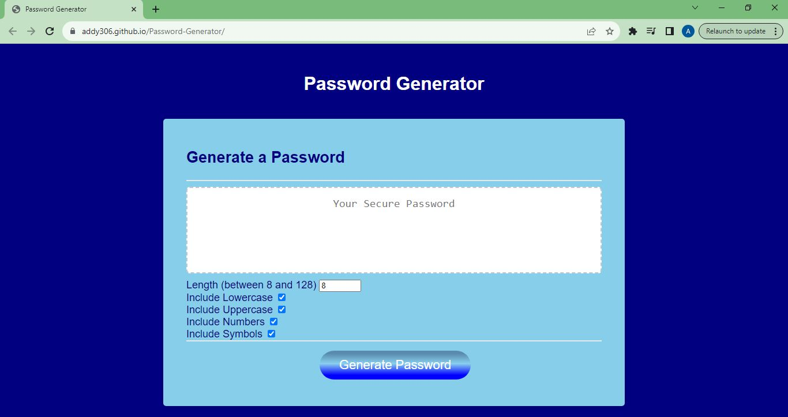
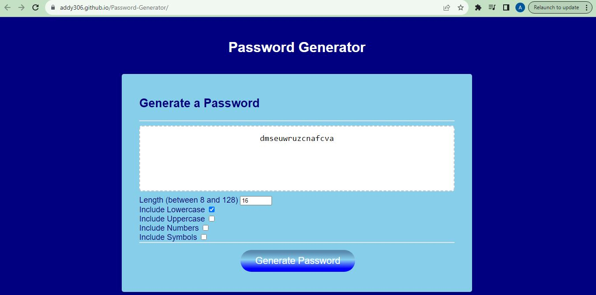
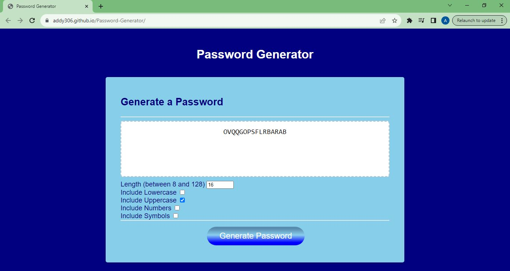
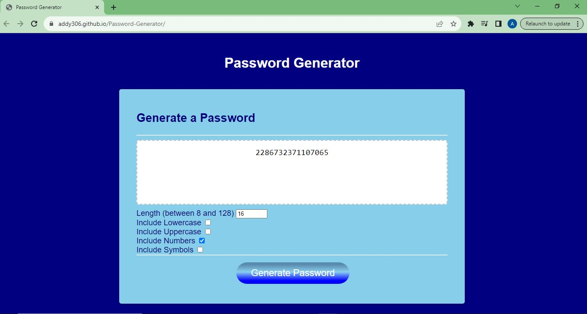
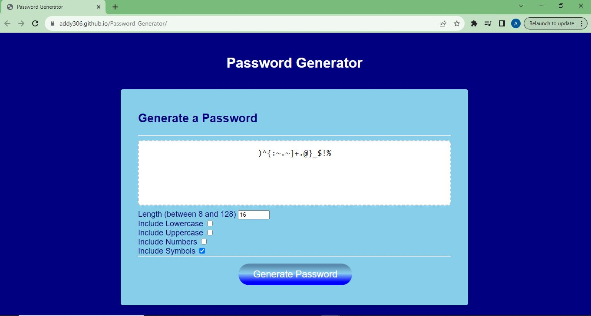
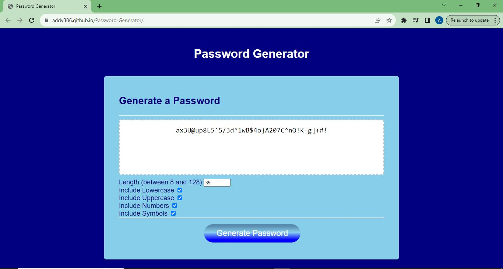
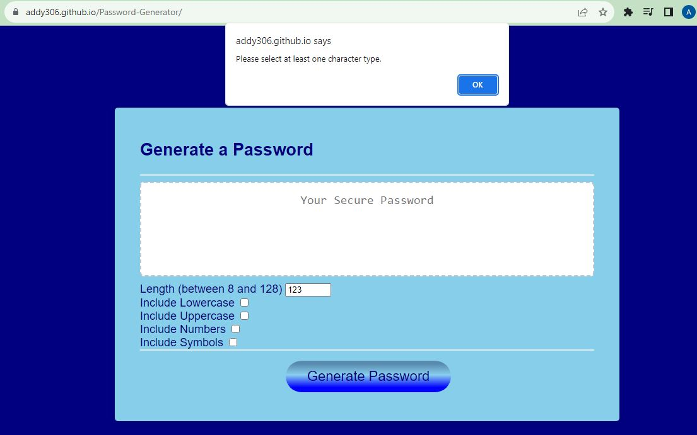
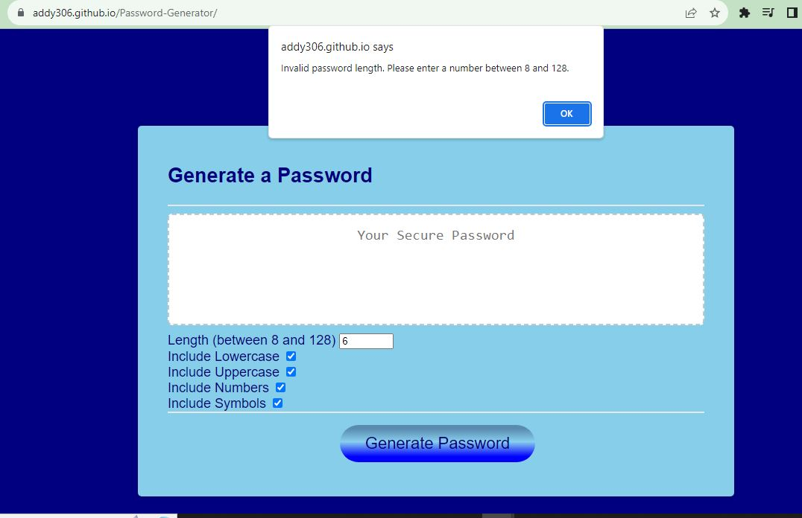
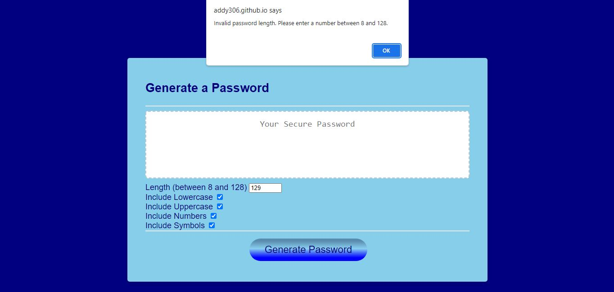

# Password-Generator

<!-- Developer Signature and github details -->
 

  

<h3 align="center">Password Generator App</h3>

  

    An application that an employee can use to generate a random password based on criteria they’ve selected.  
     
    <a href="https://github.com/addy306/Password-Generator"><strong>GitHub repository</strong></a>
     
    <a href="https://addy306.github.io/Password-Generator/"><strong>Deployed Website</strong></a>
     
     
    
  

<!-- ABOUT THE PROJECT -->
## About The Project

In this project I create an application that an employee can use to generate a random password based on criteria they’ve selected. This app runs in the browser, and features dynamically updated HTML and CSS powered by JavaScript code. It has a clean and polished user interface that is responsive, ensuring that it adapts to multiple screen sizes. The shades of Blue and white combination makes the UI more appealing to users.

## App Display Pages
This shows different pages after testing different validations and results.
### HTML Browser Default Page

### When customer checks only "lowercase" checkbox

### When customer checks only "uppercase" checkbox

### When customer checks only "number" checkbox

### When customer checks only "symbols" checkbox

### When customer checks all checkboxes

### When no checkbox is checked by customer

### When customer inputs number less than 8 for password length

### When customer inputs number greater than 128 for password length

### Built With

* HTML
* CSS
* Javascript

<!-- LICENSE -->
## License

Distributed under the MIT License. See `LICENSE.txt` for more information.

Project Link: [https://github.com/addy306/Password-Generator](https://github.com/addy306/Password-Generator)

Deployed Website: [https://addy306.github.io/Password-Generator/](https://addy306.github.io/Password-Generator/)

## Helpful Resources
- [Google](https://www.google.com/)
- [Stackoverflow](https://stackoverflow.com/)

- [W3Schools](https://www.w3schools.com/js/DEFAULT.asp)

- [Github Pages Guide](https://pages.github.com/)

